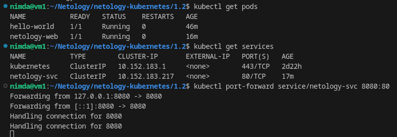

# Домашнее задание к занятию «Базовые объекты K8S» - `Горелов Николай`

### Решение 1. Создать Pod с именем hello-world

1. [Манифест yaml](./pod-hello-world.yaml)  
2.   
3.   
     
     

---

### Решение 2. Создать Service и подключить его к Pod

[netology-web.yaml](./pod-netology-web.yaml)  
[netology-svc.yaml](./service-netology-svc.yaml)  
  
  

---