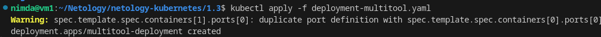
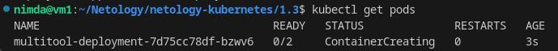
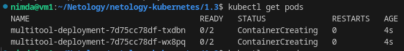
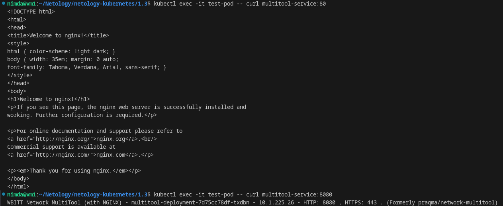
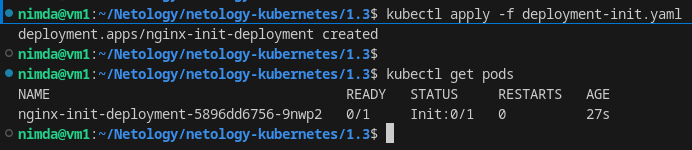
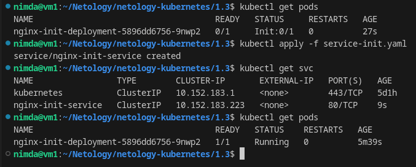

# Домашнее задание к занятию «Запуск приложений в K8S» - `Горелов Николай`

### Решение 1. Создать Deployment и обеспечить доступ к репликам приложения из другого Pod

1. Создать Deployment приложения, состоящего из двух контейнеров — nginx и multitool. Решить возникшую ошибку.
2. После запуска увеличить количество реплик работающего приложения до 2.
3. Продемонстрировать количество подов до и после масштабирования.
4. Создать Service, который обеспечит доступ до реплик приложений из п.1.
5. Создать отдельный Pod с приложением multitool и убедиться с помощью `curl`, что из пода есть доступ до приложений из п.1.

---

1. Ошибка возникла потому, что оба контейнера пытаются использовать порт 80. Исправил манифест, изменив порт для multitool на 8080.

[Исправленный deplooyment](./deployment-multitool.yaml)

2. Увеличил количество реплик исправив в строке `replicas:` 1 на 2 и пересоздав pods.
3. До масштабирования:

До масштабирования:  

4. [service-multitool.yaml](./service-multitool.yaml)
5. [test-pod.yaml](./test-pod.yaml)

---

### Решение 2. Создать Deployment и обеспечить старт основного контейнера при выполнении условий

1. Создать Deployment приложения nginx и обеспечить старт контейнера только после того, как будет запущен сервис этого приложения.
2. Убедиться, что nginx не стартует. В качестве Init-контейнера взять busybox.
3. Создать и запустить Service. Убедиться, что Init запустился.
4. Продемонстрировать состояние пода до и после запуска сервиса.

---

1. [deployment-init.yaml](./deployment-init.yaml)
2. nginx не стартует и ждет появления сервиса  
  
3. [service-init.yaml](./service-init.yaml)  
4. Состояние до и после запуска сервиса:  
  

---