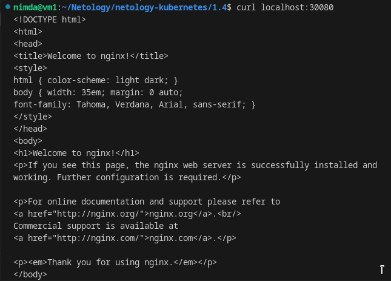

# Домашнее задание к занятию «Сетевое взаимодействие в K8S» - `Горелов Николай`

### Решение 1

1. [deployment-multi-container.yaml](./deployment-multi-container.yaml)
2. [service-clusterip.yaml](./service-clusterip.yaml)
3. [service-nodeport.yaml](./service-nodeport.yaml)
4. 
5. 

---

### Решение 2

1. [service-nodeport.yaml](./service-nodeport.yaml)  
2.   
3. 

---