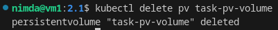

# Домашнее задание к занятию «Хранение в K8s» - `Горелов Николай`


## Решение 1

1. [containers-data-exchange.yaml](./containers-data-exchange.yaml)

<details><summary>описание пода с контейнерами (`kubectl describe pods data-exchange`)</summary>

```console

nimda@vm1:2.1$ kubectl apply -f containers-data-exchange.yaml 
deployment.apps/data-exchange created
nimda@vm1:2.1$ kubectl describe pods data-exchange
Name:             data-exchange-5ddfc8cb4c-tmn94
Namespace:        default
Priority:         0
Service Account:  default
Node:             vm1/192.168.220.139
Start Time:       Sat, 25 Oct 2025 20:27:46 +0500
Labels:           app=data-exchange
                  pod-template-hash=5ddfc8cb4c
Annotations:      cni.projectcalico.org/containerID: 466f905e7a751e0c0b03179ae639c75a1cf4fcb29e05ab2c49cc63401bba22c4
                  cni.projectcalico.org/podIP: 10.1.225.24/32
                  cni.projectcalico.org/podIPs: 10.1.225.24/32
Status:           Running
IP:               10.1.225.24
IPs:
  IP:           10.1.225.24
Controlled By:  ReplicaSet/data-exchange-5ddfc8cb4c
Containers:
  writer:
    Container ID:  containerd://619b160c67497ebd7da9ed6506ae5c0ffae1cacfced4db49821d15fecc9cad11
    Image:         busybox
    Image ID:      docker.io/library/busybox@sha256:2f590fc602ce325cbff2ccfc39499014d039546dc400ef8bbf5c6ffb860632e7
    Port:          <none>
    Host Port:     <none>
    Command:
      /bin/sh
      -c
    Args:
      while true; do
        echo "$(date) - Hello from writer container" >> /shared/data.txt
        sleep 5
      done
      
    State:          Running
      Started:      Sat, 25 Oct 2025 20:27:49 +0500
    Ready:          True
    Restart Count:  0
    Environment:    <none>
    Mounts:
      /shared from shared-data (rw)
      /var/run/secrets/kubernetes.io/serviceaccount from kube-api-access-hsb85 (ro)
  reader:
    Container ID:  containerd://adb9799938a3ab746f96a27adb7a1e2c8e6e457ea914b3cbdd665f33fdf1388e
    Image:         wbitt/network-multitool
    Image ID:      docker.io/wbitt/network-multitool@sha256:d1137e87af76ee15cd0b3d4c7e2fcd111ffbd510ccd0af076fc98dddfc50a735
    Port:          <none>
    Host Port:     <none>
    Command:
      /bin/sh
      -c
    Args:
      tail -f /shared/data.txt
      
    State:          Running
      Started:      Sat, 25 Oct 2025 20:27:51 +0500
    Ready:          True
    Restart Count:  0
    Environment:    <none>
    Mounts:
      /shared from shared-data (rw)
      /var/run/secrets/kubernetes.io/serviceaccount from kube-api-access-hsb85 (ro)
Conditions:
  Type              Status
  Initialized       True 
  Ready             True 
  ContainersReady   True 
  PodScheduled      True 
Volumes:
  shared-data:
    Type:       EmptyDir (a temporary directory that shares a pod's lifetime)
    Medium:     
    SizeLimit:  <unset>
  kube-api-access-hsb85:
    Type:                    Projected (a volume that contains injected data from multiple sources)
    TokenExpirationSeconds:  3607
    ConfigMapName:           kube-root-ca.crt
    Optional:                false
    DownwardAPI:             true
QoS Class:                   BestEffort
Node-Selectors:              <none>
Tolerations:                 node.kubernetes.io/not-ready:NoExecute op=Exists for 300s
                             node.kubernetes.io/unreachable:NoExecute op=Exists for 300s
Events:
  Type    Reason     Age   From               Message
  ----    ------     ----  ----               -------
  Normal  Scheduled  8s    default-scheduler  Successfully assigned default/data-exchange-5ddfc8cb4c-tmn94 to vm1
  Normal  Pulling    8s    kubelet            Pulling image "busybox"
  Normal  Pulled     6s    kubelet            Successfully pulled image "busybox" in 2.108s (2.108s including waiting)
  Normal  Created    6s    kubelet            Created container writer
  Normal  Started    6s    kubelet            Started container writer
  Normal  Pulling    6s    kubelet            Pulling image "wbitt/network-multitool"
  Normal  Pulled     4s    kubelet            Successfully pulled image "wbitt/network-multitool" in 1.64s (1.64s including waiting)
  Normal  Created    4s    kubelet            Created container reader
  Normal  Started    4s    kubelet            Started container reader

```

</details>


<details>

```console

nimda@vm1:2.1$ kubectl logs  data-exchange-5ddfc8cb4c-tmn94 -c reader -f
Sat Oct 25 15:27:50 UTC 2025 - Hello from writer container
Sat Oct 25 15:27:55 UTC 2025 - Hello from writer container
Sat Oct 25 15:28:00 UTC 2025 - Hello from writer container
Sat Oct 25 15:28:05 UTC 2025 - Hello from writer container
Sat Oct 25 15:28:10 UTC 2025 - Hello from writer container
Sat Oct 25 15:28:15 UTC 2025 - Hello from writer container
Sat Oct 25 15:28:20 UTC 2025 - Hello from writer container
Sat Oct 25 15:28:25 UTC 2025 - Hello from writer container
Sat Oct 25 15:28:30 UTC 2025 - Hello from writer container
Sat Oct 25 15:28:35 UTC 2025 - Hello from writer container
Sat Oct 25 15:28:40 UTC 2025 - Hello from writer container
Sat Oct 25 15:28:45 UTC 2025 - Hello from writer container


```

</details>


---

## Решение 2

Заранее создал:
``` bash
sudo mkdir -p /mnt/data
sudo chmod 777 /mnt/data  # чтобы busybox мог писать без root
```

[pv-pvc.yaml](./pv-pvc.yaml)

В представленном в ДЗ манифесте не указан явно storageClassName. А так как у меня в кластере уже есть default StorageClass, то Kubernetes автоматически подставит его имя в PVC → связывание не произойдёт. Поэтому в манифесте пришлось явно указать storageClassName.

Pod запустился и логи читаются:


Удаляем Deployment и PVC:


Смотрим что произошло с PV:


Статус: Released
Потому что reclaimPolicy: Retain — данные не удаляются автоматически.

Проверяем файл на хосте:


### Файл сохранён

Удаляем PV:



Проверьте файл снова:


 ### Файл всё ещё на месте!

Объяснение: hostPath — это прямая ссылка на директорию хоста. Удаление PV не удаляет данные на диске, потому что hostPath не управляет жизненным циклом файловой системы. Это ответственность администратора. Retain означает: «K8s не трогает данные — админ сам решает, что делать». 

---

## Решение 3

[sc.yaml](./sc.yaml)


---