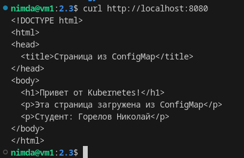
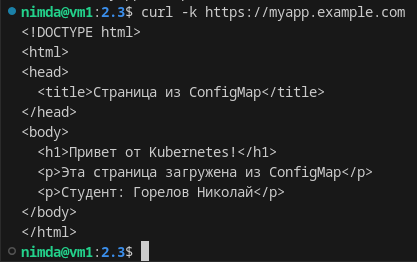
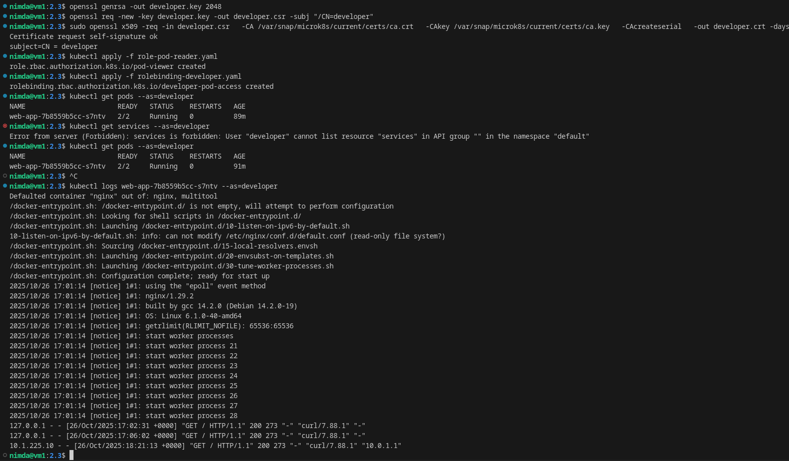

# Домашнее задание к занятию «Настройка приложений и управление доступом в Kubernetes» - `Горелов Николай`


## Решение 1

[deployment.yaml](./deployment.yaml)  
[configmap-web.yaml](./configmap-web.yaml)

# Применяем манифесты
kubectl apply -f configmap-web.yaml
kubectl apply -f deployment.yaml

# Создаем сервис для доступа
kubectl expose deployment web-app --port=80 --target-port=80

# Проверяем под
kubectl get pods -l app=web-app

# Получаем доступ к приложению
kubectl port-forward svc/web-app 8080:80



---

## Решение 2

```bash
openssl req -x509 -nodes -days 365 -newkey rsa:2048 \
  -keyout tls.key -out tls.crt -subj "/CN=myapp.example.com"
```
```bash
cat tls.crt | base64 -w 0
cat tls.key | base64 -w 0
```

[secret.tls](./secret-tls.yaml)  
[ingress-tls.yaml](./ingress-tls.yaml)  
[service.yaml](./service.yaml)  



---

## Решение 3

```bash
microk8s enable rbac
```

```bash
openssl genrsa -out developer.key 2048
openssl req -new -key developer.key -out developer.csr -subj "/CN=developer"
sudo openssl x509 -req -in developer.csr \
  -CA /var/snap/microk8s/current/certs/ca.crt \
  -CAkey /var/snap/microk8s/current/certs/ca.key \
  -CAcreateserial \
  -out developer.crt -days 365
```

[role-pod-reader.yaml](./role-pod-reader.yaml)
[rolebinding-developer.yaml](./rolebinding-developer.yaml)



Как видно просмотр подов и их логов доступно. А вот сервисы уже под запретом.

---