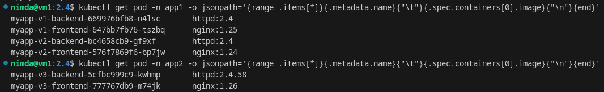

# Домашнее задание к занятию «Helm» - `Горелов Николай`


```bash
# установка helm
curl -fsSL -o get_helm.sh https://raw.githubusercontent.com/helm/helm/main/scripts/get-helm-3
chmod 700 get_helm.sh
./get_helm.sh
helm version
echo 'source <(helm completion bash)' >> ~/.bashrc

# создание нового chart
helm create myapp 

```


[Chart.yaml](myapp/Chart.yaml)  
[volues.yaml](myapp/values.yaml)  
[frontend-deployment.yaml](myapp/templates/frontend-deployment.yaml)  
[backend-deployment.yaml](myapp/templates/backend-deployment.yaml)  


```bash
# создание своих namespace
kubectl create namespace app1 
kubectl create namespace app2
# или
kubectl create ns app1
kubectl create ns app2
```


## Запускаем релизы:

```bash
helm install myapp-v1 ./myapp -n app1
helm install myapp-v2 ./myapp -n app1 --set frontend.image.tag=1.24
helm install myapp-v3 ./myapp -n app2 --set frontend.image.tag=1.26 --set backend.image.tag=2.4.58
```


## Результат:


И проверяем теги образов:

```bash
kubectl get pod -n app1 -o jsonpath='{range .items[*]}{.metadata.name}{"\t"}{.spec.containers[0].image}{"\n"}{end}'
kubectl get pod -n app1 -o jsonpath='{range .items[*]}{.metadata.name}{"\t"}{.spec.containers[0].image}{"\n"}{end}'
```

  
