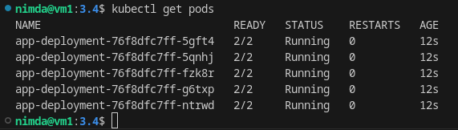
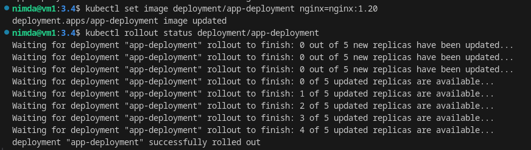
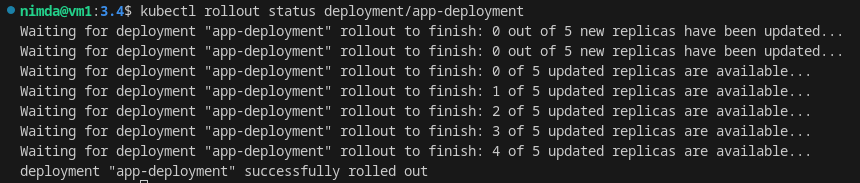
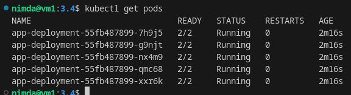

# Домашнее задание к занятию «Обновление приложений» - `Горелов Николай`


### Задание 1. Выбрать стратегию обновления приложения и описать ваш выбор

Для обновления приложения я выбираю **стратегию `Recreate`**.

#### Обоснование выбора:

Учитывая условия задания, проанализируем ключевые факторы:

1.  **Ограниченные ресурсы (запас 20%)**: Стандартная стратегия `RollingUpdate` по умолчанию использует параметры `maxSurge: 25%` и `maxUnavailable: 25%`. Это означает, что во время обновления может быть создано до 25% дополнительных подов сверх желаемого количества (surge). В нашем случае, при 5 репликах, это еще +2 пода. У нас есть только 20% запаса, что недостаточно для покрытия 25% surge. Попытка настроить `maxSurge=0` превратит стратегию в последовательную замену одного за другим, что сильно увеличит общее время обновления.

2.  **Мажорное обновление, несовместимость версий**: Новые версии приложения **не умеют работать со старыми**. При использовании `RollingUpdate`, даже с `maxUnavailable=100%`, существует период времени, когда в кластере одновременно работают поды старой и новой версии. Если эти версии взаимодействуют между собой (например, через базу данных или внутренние API), это может привести к непредсказуемому поведению, ошибкам или потере данных. Стратегия `Recreate` гарантирует, что все старые поды будут полностью завершены перед тем, как начнут создаваться новые, полностью исключая возможность смешивания версий.

3.  **Требование доступности приложения**: Хотя `Recreate` предполагает простой на время обновления, в данном конкретном случае он является *наименее рискованным* вариантом из-за проблемы несовместимости. Компромисс между временем простоя и стабильностью системы здесь решается в пользу стабильности. Простой, хоть и нежелателен, предпочтительнее, чем работающее, но некорректно функционирующее приложение.

4.  **Альтернативы (Blue/Green, Canary)**: Эти стратегии требуют двойного объема ресурсов для параллельного запуска двух версий, что прямо противоречит условию об ограниченных ресурсах и отсутствии возможности их увеличения.

**Вывод:** Несмотря на то, что стратегия `Recreate` вызовет простой приложения, она является единственно безопасной в данной ситуации. Она укладывается в ограничение по ресурсам (не требует дополнительного "surge") и полностью исключает риск конфликта между несовместимыми версиями приложения, который неизбежен при любых постепенных стратегиях обновления.

---

### Задание 2. Обновить приложение

#### Шаг 1: Создание Deployment

Создадим манифест `deployment.yaml`:

[deployment.yaml](./deployment.yaml)

Применим манифест:
```bash
kubectl apply -f deployment.yaml
```

Проверим состояние:
```bash
kubectl get pods
```



#### Шаг 2: Обновление nginx до версии 1.20

Чтобы сократить время обновления до минимума, мы воспользуемся возможностью Kubernetes перезапустить поды быстрее, если они не готовы к завершению. Мы можем изменить образ, и контроллер Deployment начнет процесс `Recreate`.

Обновим образ:
```bash
kubectl set image deployment/app-deployment nginx=nginx:1.20
```

Наблюдаем за процессом:
```bash
kubectl rollout status deployment/app-deployment
kubectl get pods -w 
```

  
  

#### Шаг 3: Попытка обновления до nginx:1.30

Выполним команду обновления:

```bash
kubectl set image deployment/app-deployment nginx=nginx:1.30
```

Проверим состояние подов:

```bash
kubectl get pods -w
```

<details>
<summary>Результат kubectl get pods -w</summary>  

```shell
nimda@vm1:3.4kubectl set image deployment/app-deployment nginx=nginx:1.30
deployment.apps/app-deployment image updated
nimda@vm1:3.4$ kubectl get pods -w
NAME                              READY   STATUS        RESTARTS   AGE
app-deployment-55fb487899-65jgc   2/2     Terminating   0          5m6s
app-deployment-55fb487899-7smbq   2/2     Terminating   0          5m6s
app-deployment-55fb487899-qrrkn   2/2     Terminating   0          5m6s
app-deployment-55fb487899-wjd2b   2/2     Terminating   0          5m6s
app-deployment-55fb487899-xzjjj   2/2     Terminating   0          5m6s
app-deployment-55fb487899-qrrkn   2/2     Terminating   0          5m34s
app-deployment-55fb487899-wjd2b   2/2     Terminating   0          5m34s
app-deployment-55fb487899-65jgc   2/2     Terminating   0          5m34s
app-deployment-55fb487899-7smbq   2/2     Terminating   0          5m34s
app-deployment-55fb487899-wjd2b   0/2     Terminating   0          5m35s
app-deployment-55fb487899-xzjjj   2/2     Terminating   0          5m35s
app-deployment-55fb487899-65jgc   0/2     Terminating   0          5m35s
app-deployment-55fb487899-qrrkn   0/2     Terminating   0          5m35s
app-deployment-55fb487899-wjd2b   0/2     Terminating   0          5m35s
app-deployment-55fb487899-wjd2b   0/2     Terminating   0          5m35s
app-deployment-55fb487899-65jgc   0/2     Terminating   0          5m35s
app-deployment-55fb487899-65jgc   0/2     Terminating   0          5m35s
app-deployment-55fb487899-7smbq   0/2     Terminating   0          5m35s
app-deployment-55fb487899-qrrkn   0/2     Terminating   0          5m35s
app-deployment-55fb487899-qrrkn   0/2     Terminating   0          5m35s
app-deployment-55fb487899-xzjjj   0/2     Terminating   0          5m35s
app-deployment-55fb487899-xzjjj   0/2     Terminating   0          5m36s
app-deployment-55fb487899-xzjjj   0/2     Terminating   0          5m36s
app-deployment-55fb487899-7smbq   0/2     Terminating   0          5m36s
app-deployment-55fb487899-7smbq   0/2     Terminating   0          5m36s
app-deployment-6f955b5c48-bfqp8   0/2     Pending       0          0s
app-deployment-6f955b5c48-vdpms   0/2     Pending       0          0s
app-deployment-6f955b5c48-bfqp8   0/2     Pending       0          0s
app-deployment-6f955b5c48-vdpms   0/2     Pending       0          0s
app-deployment-6f955b5c48-bfqp8   0/2     ContainerCreating   0          0s
app-deployment-6f955b5c48-pq2vq   0/2     Pending             0          0s
app-deployment-6f955b5c48-pq2vq   0/2     Pending             0          0s
app-deployment-6f955b5c48-lqt49   0/2     Pending             0          0s
app-deployment-6f955b5c48-wvk4v   0/2     Pending             0          0s
app-deployment-6f955b5c48-vdpms   0/2     ContainerCreating   0          0s
app-deployment-6f955b5c48-lqt49   0/2     Pending             0          0s
app-deployment-6f955b5c48-wvk4v   0/2     Pending             0          0s
app-deployment-6f955b5c48-pq2vq   0/2     ContainerCreating   0          0s
app-deployment-6f955b5c48-wvk4v   0/2     ContainerCreating   0          0s
app-deployment-6f955b5c48-lqt49   0/2     ContainerCreating   0          0s
app-deployment-6f955b5c48-vdpms   0/2     ContainerCreating   0          1s
app-deployment-6f955b5c48-pq2vq   0/2     ContainerCreating   0          1s
app-deployment-6f955b5c48-bfqp8   0/2     ContainerCreating   0          2s
app-deployment-6f955b5c48-lqt49   0/2     ContainerCreating   0          2s
app-deployment-6f955b5c48-wvk4v   0/2     ContainerCreating   0          2s
app-deployment-6f955b5c48-pq2vq   1/2     ErrImagePull        0          9s
app-deployment-6f955b5c48-lqt49   1/2     ErrImagePull        0          9s
app-deployment-6f955b5c48-wvk4v   1/2     ErrImagePull        0          9s
app-deployment-6f955b5c48-bfqp8   1/2     ErrImagePull        0          9s
app-deployment-6f955b5c48-vdpms   1/2     ErrImagePull        0          9s
app-deployment-6f955b5c48-wvk4v   1/2     ImagePullBackOff    0          10s
app-deployment-6f955b5c48-lqt49   1/2     ImagePullBackOff    0          10s
app-deployment-6f955b5c48-pq2vq   1/2     ImagePullBackOff    0          10s
app-deployment-6f955b5c48-bfqp8   1/2     ImagePullBackOff    0          10s
app-deployment-6f955b5c48-vdpms   1/2     ImagePullBackOff    0          10s
app-deployment-6f955b5c48-bfqp8   1/2     ErrImagePull        0          35s
app-deployment-6f955b5c48-lqt49   1/2     ErrImagePull        0          35s
app-deployment-6f955b5c48-pq2vq   1/2     ErrImagePull        0          36s
app-deployment-6f955b5c48-wvk4v   1/2     ErrImagePull        0          36s
app-deployment-6f955b5c48-vdpms   1/2     ErrImagePull        0          37s
app-deployment-6f955b5c48-lqt49   1/2     ImagePullBackOff    0          46s
app-deployment-6f955b5c48-pq2vq   1/2     ImagePullBackOff    0          47s
app-deployment-6f955b5c48-bfqp8   1/2     ImagePullBackOff    0          50s
app-deployment-6f955b5c48-wvk4v   1/2     ImagePullBackOff    0          51s
app-deployment-6f955b5c48-vdpms   1/2     ImagePullBackOff    0          52s
app-deployment-6f955b5c48-pq2vq   1/2     ErrImagePull        0          62s
app-deployment-6f955b5c48-lqt49   1/2     ErrImagePull        0          64s
app-deployment-6f955b5c48-wvk4v   1/2     ErrImagePull        0          65s
app-deployment-6f955b5c48-vdpms   1/2     ErrImagePull        0          66s
app-deployment-6f955b5c48-bfqp8   1/2     ErrImagePull        0          67s
app-deployment-6f955b5c48-pq2vq   1/2     ImagePullBackOff    0          77s
app-deployment-6f955b5c48-bfqp8   1/2     ImagePullBackOff    0          78s
app-deployment-6f955b5c48-wvk4v   1/2     ImagePullBackOff    0          78s
app-deployment-6f955b5c48-lqt49   1/2     ImagePullBackOff    0          78s
app-deployment-6f955b5c48-vdpms   1/2     ImagePullBackOff    0          79s
app-deployment-6f955b5c48-lqt49   1/2     ErrImagePull        0          108s
app-deployment-6f955b5c48-pq2vq   1/2     ErrImagePull        0          115s
app-deployment-6f955b5c48-lqt49   1/2     ImagePullBackOff    0          119s
app-deployment-6f955b5c48-bfqp8   1/2     ErrImagePull        0          2m
app-deployment-6f955b5c48-wvk4v   1/2     ErrImagePull        0          2m
app-deployment-6f955b5c48-vdpms   1/2     ErrImagePull        0          2m4s
app-deployment-6f955b5c48-pq2vq   1/2     ImagePullBackOff    0          2m7s
app-deployment-6f955b5c48-bfqp8   1/2     ImagePullBackOff    0          2m12s
app-deployment-6f955b5c48-wvk4v   1/2     ImagePullBackOff    0          2m14s
app-deployment-6f955b5c48-vdpms   1/2     ImagePullBackOff    0          2m17s
```

</details>  

Исследуем проблему:

<details>
<summary>Проблема</summary>

```shell
    Ready:          True
    Restart Count:  0
    Limits:
      cpu:     200m
      memory:  64Mi
    Requests:
      cpu:        100m
      memory:     32Mi
    Environment:  <none>
    Mounts:
      /var/run/secrets/kubernetes.io/serviceaccount from kube-api-access-ttphn (ro)
Conditions:
  Type              Status
  Initialized       True 
  Ready             False 
  ContainersReady   False 
  PodScheduled      True 
Volumes:
  kube-api-access-ttphn:
    Type:                    Projected (a volume that contains injected data from multiple sources)
    TokenExpirationSeconds:  3607
    ConfigMapName:           kube-root-ca.crt
    Optional:                false
    DownwardAPI:             true
QoS Class:                   Burstable
Node-Selectors:              <none>
Tolerations:                 node.kubernetes.io/not-ready:NoExecute op=Exists for 300s
                             node.kubernetes.io/unreachable:NoExecute op=Exists for 300s
Events:
  Type    Reason   Age                  From     Message
  ----    ------   ----                 ----     -------
  Normal  BackOff  102s (x42 over 11m)  kubelet  Back-off pulling image "nginx:1.30"
```

</details>

В задании указана версия 1.28, но она на момент выполнения задания уже существует. Поэтому берём версию 1.30 и добиваемся появления ошибки.Ошибка возникает потому, что тег `1.30` для официального образа nginx **не существует**. Контроллер продолжает пытаться запустить поды, но они постоянно падают.

#### Шаг 4: Откат после неудачного обновления

Поскольку обновление не удалось, выполним откат к последней рабочей версии:
```bash
kubectl rollout undo deployment/app-deployment
```

Проверим результат:
```bash
kubectl rollout status deployment/app-deployment
```



```bash
kubectl get pods
```



Откат выполнен успешно, приложение снова работает.

---