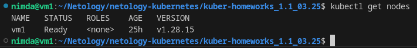
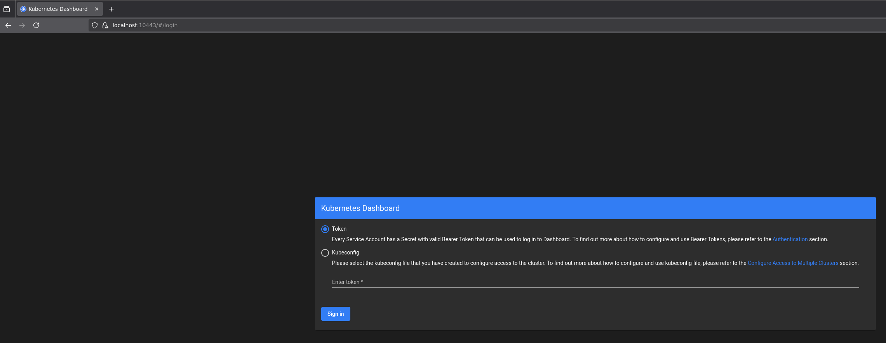
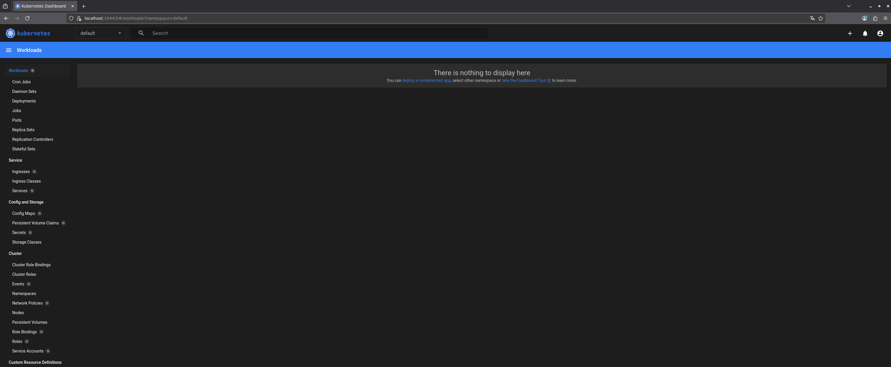

# Домашнее задание к занятию «Kubernetes. Причины появления. Команда kubectl» - `Горелов Николай`

## Установка и настрока

1. Установка MicroK8S:
    - sudo apt update,
    - sudo apt install snapd,
    - sudo snap install snapd,  обновление snapd до последней версии, иначе следующая команда будет выдавать ошибку,
    - sudo snap install microk8s --classic,
    - добавить локального пользователя в группу `sudo usermod -a -G microk8s $USER`,
    - изменить права на папку с конфигурацией `sudo chown -f -R $USER ~/.kube`.

Повышаем права, иначе система будет ругаться на отсутствие microk8s `su - $USER`

Включаем dashboard `microk8s enable dashboard`
Проверяем `microk8s status`

2. Установка kubectl:
    - curl -LO https://storage.googleapis.com/kubernetes-release/release/`curl -s https://storage.googleapis.com/kubernetes-release/release/stable.txt`/bin/linux/amd64/kubectl;
    - chmod +x ./kubectl;
    - sudo mv ./kubectl /usr/local/bin/kubectl;
    - настройка автодополнения в текущую сессию `bash source <(kubectl completion bash)`;
    - добавление автодополнения в командную оболочку bash `echo "source <(kubectl completion bash)" >> ~/.bashrc`.

- проброс порта для подключения локально `microk8s kubectl port-forward -n kube-system service/kubernetes-dashboard 10443:443`.

- открываем браузер и заходим `https://127.0.0.1:10443`

- создаем токен и вводим на страницу выше - `microk8s kubectl create token default`

- попадаем на страницу dashboard kubernetes

---